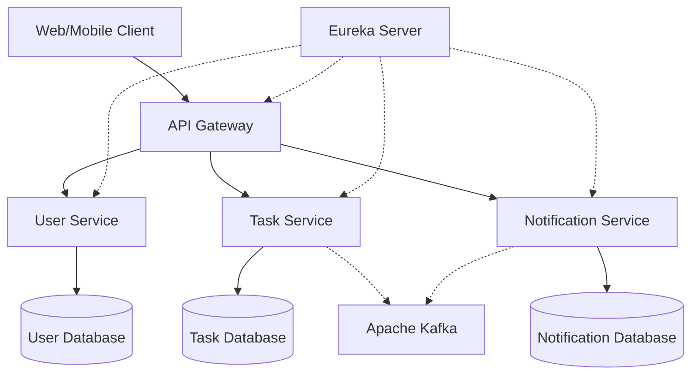

# 📋 Task Master

[](https://github.com/your-org/task-management-platform)
[](https://github.com/your-org/task-management-platform)
[](LICENSE)
[](https://openjdk.java.net/)
[](https://spring.io/projects/spring-boot)

> A modern, scalable task management platform built with microservices architecture using Spring Boot, Spring Cloud, and cloud-native technologies.

## 🏗️ Architecture Overview



## 🚀 Services

| Service | Port | Description | Technology Stack |
|---------|------|-------------|------------------|
| [**API Gateway**](./api-gateway/) | 8080 | Entry point, routing, load balancing | Spring Cloud Gateway |
| [**Eureka Server**](./eureka-server/) | 8761 | Service discovery and registration | Netflix Eureka |
| [**User Service**](./user-service/) | 8082 | Authentication, user management | Spring Boot, JWT, PostgreSQL |
| [**Task Service**](./task-service/) | 8084 | Task CRUD, categorization, filtering | Spring Boot, MySQL |
| [**Notification Service**](./notification-service/) | 8085 | Real-time notifications | Spring Boot, Kafka, MongoDB |

## ⚡ Quick Start

### Prerequisites
- **Java 17+**
- **Maven 3.8+**
- **Docker & Docker Compose**
- **Git**

### 🐳 Local Development with Docker

```bash
# Clone the repository
git clone https://github.com/sapunethmini/TaskMaster.git
cd Taskmaster

# Start all services with Docker Compose
docker-compose up -d

# Verify services are running
docker-compose ps
```

### 🛠️ Manual Setup

```bash
# Start Eureka Server
cd eureka-server
mvn spring-boot:run

# Start API Gateway
cd ../api-gateway
mvn spring-boot:run

# Start User Service
cd ../user-service
mvn spring-boot:run

# Start Task Service
cd ../task-service
mvn spring-boot:run

# Start Notification Service
cd ../notification-service
mvn spring-boot:run
```

## 📚 API Documentation

| Service | Swagger UI | API Docs |
|---------|------------|----------|
| User Service | http://localhost:8082/swagger-ui/index.html | [User API](http://localhost:8082/v3/api-docs) |
| Task Service | http://localhost:8084/swagger-ui/index.html | [Task API](http://localhost:8084/v3/api-docs) |
| Notification Service | http://localhost:8085/swagger-ui/index.html | [Notification API](http://localhost:8085/v3/api-docs) |

## 🔧 Configuration

### Environment Variables

```bash
# Database Configuration
SPRING_PROFILES_ACTIVE=dev
USER_DB_URL=jdbc:postgresql://localhost:5432/userdb
TASK_DB_URL=jdbc:mysql://localhost:3306/taskdb
NOTIFICATION_DB_URL=mongodb://localhost:27017/notificationdb

# Kafka Configuration
KAFKA_BOOTSTRAP_SERVERS=localhost:9092

# JWT Configuration
JWT_SECRET=your-secret-key
JWT_EXPIRATION=86400000

# Eureka Configuration
EUREKA_SERVER_URL=http://localhost:8761/eureka
```

## 🚀 Deployment

### AWS Deployment

```bash
# Build Docker images
./scripts/build-images.sh

# Deploy to AWS ECS
./scripts/deploy-aws.sh

# Configure AWS resources
terraform init
terraform plan
terraform apply
```

ser-service && mvn test
```

## 🔒 Security

- **Authentication**: JWT tokens
- **Authorization**: Role-based access control (RBAC)
- **API Security**: OAuth 2.0 + OpenID Connect
- **Secrets Management**: AWS Secrets Manager / HashiCorp Vault

## 🤝 Contributing

1. Fork the repository
2. Create a feature branch (`git checkout -b feature/amazing-feature`)
3. Commit your changes (`git commit -m 'Add amazing feature'`)
4. Push to the branch (`git push origin feature/amazing-feature`)
5. Open a Pull Request

See [CONTRIBUTING.md](./CONTRIBUTING.md) for detailed guidelines.

## 📁 Project Structure

```
task-management-platform/
├── api-gateway/              # Spring Cloud Gateway
├── eureka-server/           # Service Discovery
├── user-service/           # User Management Service
├── task-service/           # Task Management Service
├── notification-service/   # Notification Service
├── docker-compose.yml      # Local development setup
├── docs/                  # Documentation
└── README.md             # This file
```

## 🏃‍♂️ Development Workflow

### Phase 1: Foundation ✅
- [x] Service Discovery (Eureka)
- [x] API Gateway setup
- [x] Basic service structure

### Phase 2: Core Services 🚧
- [x] User Service implementation
- [x] Task Service implementation
- [ ] Notification Service implementation

### Phase 3: DevOps 📋
- [ ] Docker containerization
- [ ] Cloud deployment (AWS)

## 🆘 Troubleshooting

### Common Issues

**Services not registering with Eureka**
```bash
# Check Eureka server logs
docker logs eureka-server

# Verify network connectivity
curl http://localhost:8761/eureka/apps
```

**Database connection issues**
```bash
# Check database containers
docker-compose ps db

# Test database connectivity
docker exec -it mysql-db mysql -u root -p
```

## 📞 Support

- **Documentation**: [Wiki](https://github.com/your-org/task-management-platform/wiki)
- **Issues**: [GitHub Issues](https://github.com/your-org/task-management-platform/issues)
- **Discussions**: [GitHub Discussions](https://github.com/your-org/task-management-platform/discussions)

## 📄 License

This project is licensed under the MIT License - see the [LICENSE](LICENSE) file for details.

---

**Made with ❤️ by the Sapuni Dheerasinghe**
